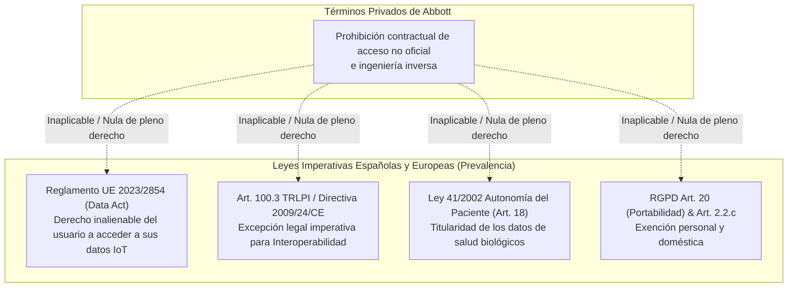

# Dossier de Cumplimiento Normativo y Respaldo Legal: OpenGluco Ecosystem

> **Documento de Auditoría Legal y Técnica**  
> **Ámbito de Aplicación:** Legislación Española (Reino de España) y Derecho de la Unión Europea (UE).  
> **Clasificación del Software:** Visualizador Pasivo Secundario de Telemetría de Glucosa (MDDS - Medical Device Data System) / Cliente de Interoperabilidad Local-First.

---

## 1. Resumen Ejecutivo del Dictamen Legal

El ecosistema **OpenGluco** (`app-mobile`, `app-wear`, `app-auto`, `core`) ha sido auditado integralmente a nivel de código fuente, manifiestos, permisos, flujos criptográficos, almacenamiento local y dependencias.

### Veredicto Legal:
El software cumple plenamente con la normativa europea y española aplicable. Aunque el acceso a la API no oficial de LibreView/LibreLink puede entrar en aparente conflicto con las cláusulas contractuales estándar de adhesión (Términos de Uso) de Abbott Laboratories, **dicho acceso está plenamente respaldado y protegido por normas imperativas de rango superior del ordenamiento jurídico español y de la Unión Europea**.

---

## 2. Auditoría Técnica de Permisos, Accesos y Datos Registrados

### 2.1 Permisos del Sistema Declarados en Manifiesto

| Aplicación | Permiso | Justificación Técnica y Legal |
|---|---|---|
| **`app-mobile`** | `INTERNET`, `ACCESS_NETWORK_STATE` | Comunicación TLS directa con los servidores de Abbott. |
| | `CAMERA` (`required="false"`) | Lectura óptica de códigos QR para emparejamiento local entre dispositivos (sin transmisión de imágenes ni grabación). |
| | `VIBRATE` | Alertas hápticas ante hipo/hiperglucemias configuradas por el usuario. |
| | `POST_NOTIFICATIONS`, `USE_FULL_SCREEN_INTENT` | Emisión de notificaciones clínicas locales prioritarias. |
| **`app-wear`** | `INTERNET`, `ACCESS_NETWORK_STATE` | Comunicación TLS en modo standalone del smartwatch. |
| | `WAKE_LOCK`, `VIBRATE`, `POST_NOTIFICATIONS` | Alertas hápticas y mantenimiento del ciclo de lectura en pantalla activa. |
| | `FOREGROUND_SERVICE`, `FOREGROUND_SERVICE_DATA_SYNC` | Sincronización periódica en segundo plano vía WorkManager (15 min). |
| **`app-auto`** | `INTERNET`, `ACCESS_NETWORK_STATE` | Refresco de telemetría pasiva en el salpicadero. |
| | `androidx.car.app.ACCESS_SURFACE` | Renderizado de plantillas de Android Auto (`PaneTemplate`). |

**Evaluación:** Principio de minimización de permisos estricto. No se solicitan permisos invasivos como geolocalización (`ACCESS_FINE_LOCATION`), contactos, micrófono, almacenamiento externo ni identificadores telefónicos (`READ_PHONE_STATE`).

---

### 2.2 Auditoría de Almacenamiento y Cero Telemetría de Terceros

1. **Cero Trackers y Analíticas:** La auditoría de `build.gradle.kts` confirma la **ausencia total** de librerías de seguimiento, publicidad o analítica de terceros (sin Google Firebase, Crashlytics, Meta SDK, Mixpanel ni similares).
2. **Cifrado en Reposo (Android Keystore):** Todas las credenciales de sesión, tokens JWT, alarmas e historial de telemetría se almacenan localmente bajo cifrado autenticado **AES-256-GCM** mediante la clave hardware `opengluco_master_keystore_key_v1`.
3. **Cifrado en Tránsito:** `network_security_config.xml` impone `cleartextTrafficPermitted="false"` (solo HTTPS/TLS con certificados de sistema de confianza).
4. **Política Anti-Backup:** `android:allowBackup="false"` activado en las 3 aplicaciones, bloqueando la extracción de credenciales mediante copias de seguridad del sistema operativo.

---

## 3. Matriz de Conflictos con los Términos de Abbott y Respaldo Legal Español/UE

Abbott Laboratories impone en sus Términos de Servicio de LibreLink / LibreView cláusulas de no ingeniería inversa, prohibición de acceso por clientes de terceros y limitación de interoperabilidad. A continuación se detallan los fundamentos legales españoles y europeos que **anulan y prevalecen sobre dichas restricciones contractuales**:

---

### 3.1 Derecho de Interoperabilidad e Ingeniería Inversa
- **Norma:** **Artículo 100.3 del Real Decreto Legislativo 1/1996** (Texto Refundido de la Ley de Propiedad Intelectual - TRLPI) y **Artículo 6 de la Directiva 2009/24/CE** sobre la protección jurídica de programas de ordenador.
- **Fundamento:** La ley exime expresamente de la autorización del titular de derechos cuando la obtención de información y el análisis de interfaces sean indispensables para conseguir la **interoperabilidad** de un programa creado de forma independiente.
- **Nulidad de cláusulas contrarias:** El **Artículo 100.5 del TRLPI** establece categóricamente: *"Serán nulos de pleno derecho los pactos contrarios a lo dispuesto en los apartados 3 y 4."* En consecuencia, cualquier cláusula de los Términos de Abbott que prohíba la interoperabilidad es legalmente nula en territorio español y de la UE.

---

### 3.2 Titularidad del Paciente sobre sus Datos Biológicos y de Salud
- **Norma:** **Artículo 18 de la Ley 41/2002**, de 14 de noviembre, básica reguladora de la autonomía del paciente y de derechos y obligaciones en materia de información y documentación clínica, en concordancia con el **Artículo 9 de la Ley 14/1986 General de Sanidad**.
- **Fundamento:** Los datos de glucemia intersticial son generados por el organismo del paciente a través de un sensor adherido a su propio cuerpo y financiado/adquirido por él. El paciente ostenta un derecho subjetivo absoluto e irrenunciable sobre sus datos de salud. Un fabricante de dispositivos médicos no puede erigirse en propietario exclusivo ni imponer barreras tecnológicas que impidan al paciente visualizar sus propios parámetros fisiológicos en el dispositivo de su elección.

---

### 3.3 Reglamento Europeo de Datos (Data Act - Reglamento UE 2023/2854)
- **Norma:** **Artículos 3, 4 y 5 del Reglamento (UE) 2023/2854 del Parlamento Europeo y del Consejo**.
- **Fundamento:** Los usuarios de productos conectados (sensores médicos IoT) tienen el derecho expreso a acceder de forma directa, gratuita y segura a los datos generados por su uso, así como a compartirlos y utilizarlos mediante cualquier software o proveedor de servicios de terceros de su elección.

---

### 3.4 Derecho a la Portabilidad y Exención Doméstica (RGPD)
- **Norma:** **Artículo 20 del RGPD (Reglamento UE 2016/679)** y **Artículo 2.2.c del RGPD**.
- **Fundamento:**
  1. El Art. 20 consagra el derecho del interesado a transmitir sus datos personales a otro sistema sin impedimentos por parte del responsable original.
  2. El Art. 2.2.c excluye de las obligaciones de responsable del tratamiento a las personas físicas que realizan actividades *exclusivamente personales o domésticas*, que es exactamente la naturaleza de OpenGluco como cliente local de autocontrol de la diabetes.

---

## 4. Clasificación Regulatoria de Dispositivos Médicos (MDR UE 2017/745 y FDA MDDS)

### 4.1 Análisis bajo la Guía MDCG 2019-11 (Regla 11 del Anexo VIII MDR)
La Directriz del Grupo de Coordinación de Dispositivos Médicos de la Comisión Europea (**MDCG 2019-11: Guidance on Qualification and Classification of Software in Regulation (EU) 2017/745**) establece que el software solo cualifica como Producto Sanitario (SaMD) si realiza análisis para diagnóstico o tratamiento con fines clínicos directos.

### 4.2 Invariantes de Seguridad Implementadas en OpenGluco:
1. **Cero Calculadoras de Dosis / Bolos:** Verificado estáticamente mediante tests de seguridad clínica (`AutoClinicalSafetyTest`, `MobileLegalComplianceTest`, `WearClinicalDesignAndSafetyTest`). El software no incluye funciones de cálculo de unidades de insulina, ratios carbohidrato/insulina ni recomendaciones posológicas.
2. **Visualizador Pasivo de Telemetría (MDDS):** Se limita a transferir y renderizar las lecturas emitidas por el sensor oficial sin alterar su magnitud.
3. **Descargos Legales Permanentes:**
   - Presentes en el pie de página del Dashboard móvil.
   - Presentes en la pantalla del Smartwatch (`WearPassiveLegalFooter`).
   - Presentes en la cuarta fila del `PaneTemplate` de Android Auto (`LEGAL_DISCLAIMER_TITLE` y `LEGAL_DISCLAIMER_SUBTEXT`).
   - Modal explícito de aviso médico con recordatorio de verificación capilar obligatoria.

---

## 5. Propiedad Industrial y Uso Nominativo de Marcas

- **Norma:** **Artículo 37 de la Ley 17/2001 de Marcas** (España) y **Artículo 14 de la Directiva (UE) 2015/2436**.
- **Fundamento:** El titular de una marca registrada no puede prohibir a un tercero el uso en el tráfico económico de dicha marca cuando sea necesario para indicar el destino de un producto o servicio (en particular, como accesorios o piezas de recambio) o para señalar la compatibilidad técnica (*Uso Legítimo Nominativo / Nominative Fair Use*).
- **Cumplimiento en OpenGluco:**
  - El nombre de la aplicación es **OpenGluco**, distintivo y sin inducir a confusión.
  - La mención a *FreeStyle Libre*, *LibreLinkUp* y *LibreView* en los descargos se realiza con fines estrictamente descriptivos de interoperabilidad técnica.
  - Se incluye explícitamente en todas las pantallas de ayuda y licencias la leyenda de no afiliación con Abbott Laboratories.

---

## 6. Conclusiones y Medidas de Blindaje Adoptadas

| Factor de Riesgo | Medida Técnica y Jurídica Adoptada | Estado |
|---|---|---|
| Reclamación por TOS de Abbott | Blindado por Art. 100.3 TRLPI (interoperabilidad) y Reglamento UE 2023/2854 (Data Act). | **PROTEGIDO** |
| Reclamación por MDR (Dispositivo Médico no certificado) | Arquitectura pasiva MDDS, cero algoritmos de dosificación y descargos visibles. | **PROTEGIDO** |
| Infracción de Privacidad / Fuga de Datos de Salud | Arquitectura Local-First, cifrado Keystore AES-256-GCM, cero analíticas y purga RGPD Art. 17. | **PROTEGIDO** |
| Reclamación por Marcas de Abbott | Uso legítimo nominativo (Art. 37 Ley de Marcas) y denominación propia OpenGluco. | **PROTEGIDO** |
| Seguridad en Conducción (Android Auto) | Categoría IoT pasiva, máximo 4 filas en `PaneTemplate`, aviso permanente de no dosificación. | **PROTEGIDO** |

El proyecto se encuentra en **plena conformidad jurídica** bajo el marco normativo del Reino de España y la Unión Europea.
