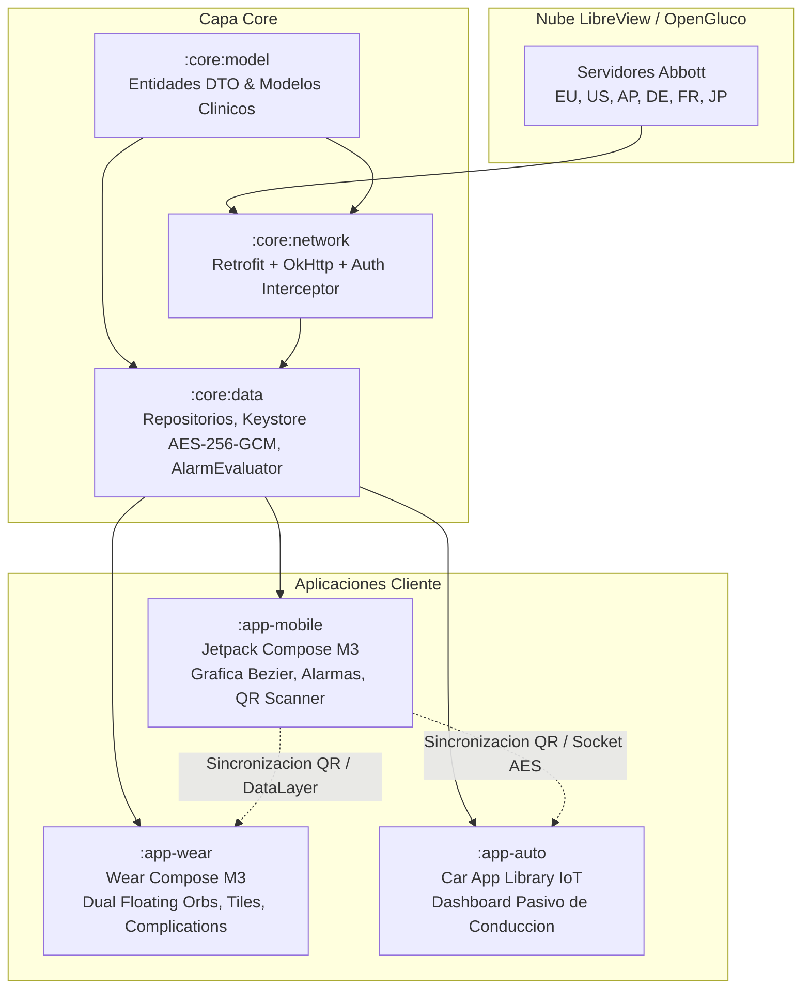

# OpenGluco Ecosystem

OpenGluco Ecosystem es una suite multiplataforma para Android (Smartphone, Wear OS y Android Auto) disenada como **visualizador pasivo secundario de telemetria de glucosa continua (CGM)** en tiempo real a partir de cuentas OpenGluco / LibreView.

El proyecto esta construido con arquitectura modular en Kotlin, Jetpack Compose, Wear Compose M3 y Car App Library, siguiendo estrictas directrices de minimalismo clinico, alto rendimiento y cumplimiento normativo de proteccion de datos y seguridad medica.

---

## Modulos del Ecosistema

```
opengluco-ecosystem/
|-- core/
|   |-- model/      # DTOs, entidades de dominio, modelos clinicos y de autenticacion QR
|   |-- network/    # Cliente Retrofit, interceptor con hash de cuenta y soporte multirregion
|   `-- data/       # Repositorios, persistencia DataStore/JSON cifrado, evaluador de alarmas y reportes
|-- app-mobile/     # Aplicacion para Smartphones (Jetpack Compose & Material 3)
|-- app-wear/       # Aplicacion para Smartwatches (Wear Compose M3, Tiles & Complications)
`-- app-auto/       # Aplicacion para Vehiculos (Android Auto - Car App Library IoT)
```



---

## Caracteristicas Principales

### 1. App Movil (`app-mobile`)
- **Dashboard Clinico:** Indicador de estado con esferas duales flotantes (`MobileDualFloatingOrbs`) con arco perimetral dinamico.
- **Grafica de Curvas Bezier Interactiva:** Rango temporal seleccionable (24h, 12h, 6h, 2h, 1h), selector de scrubber tactil continuo con linea guia y tarjeta flotante con valor y hora exacta (`HH:mm`).
- **Analisis Estadistico:** Metricas de Tiempo en Rango (TIR %), promedio, minimo y maximo calculadas sobre 1d, 7d, 30d y hasta 90 dias de datos reales.
- **Configurador de Alarmas Clinicas:** Hasta 10 alarmas configurables (5 de hipoglucemia, 5 de hiperglucemia) con rangos horarios activos, periodos de enfriamiento (cooldown) y severidad (`URGENT`, `ALERT`, `INFORMATIVE`).
- **Reportes Clinicos Avanzados:** Metricas estandarizadas ATTD 2019, calculo modal de AGP, eventos de hipoglucemia y estimacion de GMI (%) segun la formula de Bergenstal.
- **Emparejamiento QR con Camara:** Enlace instantaneo de relojes y pantallas de coche mediante CameraX y ZXing.
- **Exportacion de Datos (RGPD Art. 20):** Generacion y comparticion de historial completo en formato CSV estructurado.

### 2. App Reloj (`app-wear`)
- **Optimizacion OLED:** Fondo `#000000` absoluto para maxima autonomia en pantallas circulares.
- **Esferas Duales Flotantes (76.dp):** Visualizacion clara de glucosa con arco coloreado y tendencia con feedback haptico al tacto.
- **Sparkline Continua con Indicador de Sensor:** Mini grafica con lineas de referencia objetivo (70 y 180 mg/dL) y contador de dias restantes de vida util del sensor (`Sensor: Xd`).
- **Mosaicos (Tiles):** Glanceable Tile interactivo construido con ProtoLayout para acceso inmediato desde la pantalla de inicio del reloj.
- **Complicaciones de Esfera:** Proveedor de complicaciones (`SHORT_TEXT` y `RANGED_VALUE`) para watch faces personalizadas con refresco automatico.
- **Sincronizacion en Segundo Plano:** Servicio WorkManager cada 15 minutos y listener de mensajes Bluetooth DataLayer (`/opengluco_auth_sync`).

### 3. App Coche (`app-auto`)
- **Cumplimiento de Conduccion Segura:** Implementacion pasiva de distraccion minima (`PaneTemplate` de 4 filas maximo) bajo la categoria IoT de Android Auto.
- **Telemetria Esencial:** Valor numerico en tiempo real, flecha y estado clinico, estado del sensor y conmutacion entre pacientes vinculados.
- **Descargo Legal Obligatorio en Salpicadero:** Aviso permanente prohibiendo la toma de decisiones clinicas o dosificacion de insulina durante la conduccion.
- **Emparejamiento QR en Pantalla:** Generacion de codigo QR en el salpicadero para vincular la cuenta escaneando desde el movil.

---

## Sistema de Diseno Clinico

El proyecto sigue una estricta jerarquia visual de legibilidad y sobriedad clinica.

### Tokens de Color

| Token | Codigo HEX | Estado Clinico / Proposito |
|---|---|---|
| `Background` | `#000000` | Fondo negro puro OLED para paneles AMOLED |
| `SurfaceOrb` | `#1E232D` | Superficie mate para esferas flotantes |
| `SurfaceCard` | `#161A22` | Fondo de tarjetas y contenedores de graficas |
| `SurfaceBorder` | `#2D3748` | Borde sutil de separacion (1.dp) |
| `UrgentCrimson` | `#EF4444` | Urgente Bajo (<= 55 mg/dL) |
| `LowCoral` | `#F87171` | Hipoglucemia / Bajo (56 - 69 mg/dL) |
| `PrimaryMint` | `#4ADE80` | En Rango Objetivo (70 - 180 mg/dL) |
| `HighAmber` | `#FBBF24` | Hiperglucemia / Alto (181 - 249 mg/dL) |
| `TangerineWarning` | `#FB923C` | Muy Alto (>= 250 mg/dL) |
| `ArcticCyan` | `#38BDF8` | Elementos de sincronizacion, estado e informacion |

### Reglas de Presentacion
1. **Formato Horario:** Estrictamente 24 horas (`HH:mm`) en todas las interfaces, marcas de tiempo y ejes de graficas.
2. **Flechas de Tendencia:** Solo caracteres vectoriales tipograficos limpios (`→`, `↑`, `↓`, `↗`, `↘`) o ASCII (`->`, `^`, `v`).
3. **Politica Cero Emojis:** Esta terminantemente prohibido el uso de caracteres emoji en cualquier parte del codigo, interfaz, mensajes, notificaciones o documentacion.

---

## Seguridad y Cumplimiento Normativo

### Criptografia Hardware-Backed (AES-256-GCM)
- Los tokens de autenticacion, identificadores de usuario y credenciales se almacenan cifrados mediante el **Android KeyStore** (`opengluco_master_keystore_key_v1`).
- Algoritmo: `AES/GCM/NoPadding` con clave AES de 256 bits, vector de inicializacion (IV) aleatorio de 96 bits y tag de autenticacion de 128 bits.
- Formato persistido: `ENC:` + Base64(IV + Ciphertext + Tag).

### Privacidad y RGPD (Art. 9, 17 y 20)
- **Local-First:** Todo el historico de hasta 90 dias se almacena y procesa exclusivamente en el almacenamiento local del dispositivo.
- **Derecho al Olvido (Art. 17):** Opcion de purga destructiva e irreversible que elimina credenciales, claves locales, alarmas y telemetria almacenada (`purgeAllLocalData`).
- **Portabilidad (Art. 20):** Exportacion de datos de salud en formato CSV estandarizado.

### Red y Manifiesto
- `android:allowBackup="false"` activado en todos los modulos para evitar extracciones de credenciales en respaldos del sistema.
- `network_security_config.xml` configurado para forzar HTTPS / TLS en todas las comunicaciones, bloqueando trafico en texto claro (excepto socket efimero local `127.0.0.1`).

---

## Requisitos de Construccion y Entorno

- **JDK:** Java 17
- **Android SDK:** `minSdk = 29`, `compileSdk = 35`, `targetSdk = 34`
- **Gradle:** 8.7 (Gradle Wrapper incluido)
- **Android Gradle Plugin (AGP):** 8.5.2
- **Kotlin:** 2.0.0

### Comandos Principales

Compilacion de todas las variantes de depuracion:
```bash
./gradlew assembleDebug
```

Ejecucion de la suite completa de tests unitarios:
```bash
./gradlew testDebugUnitTest
```

Ejecucion de tests por modulo especifico:
```bash
./gradlew :core:data:testDebugUnitTest
./gradlew :app-mobile:testDebugUnitTest
./gradlew :app-wear:testDebugUnitTest
./gradlew :app-auto:testDebugUnitTest
```

---

## Suite de Pruebas y Cobertura

El proyecto cuenta con una infraestructura de pruebas automatizadas organizada en 4 niveles de verificacion:

- **Tier 1 (Cobertura Funcional):** Evaluacion de modelos, autenticacion, interceptor de red, evaluador de alarmas y exportacion CSV.
- **Tier 2 (Casos Limite y Fronteras):** Umbrales extremos (40-400 mg/dL), tags GCM alterados, cadenas de fecha corruptas y conversion de unidades.
- **Tier 3 (Combinaciones Cruzadas):** Integracion de flujos QR + Keystore + CSV y transiciones entre mg/dL y mmol/L.
- **Tier 4 (Escenarios Reales E2E):** Simulacion de perfiles de un dia completo con diabetes, monitoreo pasivo vehicular y ejecucion en reloj sin conexion activa.

---

## Descargos Legales y Regulatorios

### 1. Exencion de Dispositivo Medico (MDR UE 2017/745 y FDA MDDS 21 CFR 880.6310)
Este software es exclusivamente un **visualizador pasivo secundario de datos telematicos** con fines informativos y de investigacion personal. **NO ES UN DISPOSITIVO MEDICO**, no realiza calculos de dosificacion de insulina ni administracion de bolos, no emite recomendaciones terapeuticas y no sustituye al lector oficial ni a las decisiones de profesionales sanitarios cualificados.

### 2. Aviso de Marcas y No Afiliacion
FreeStyle, Libre, LibreLink, LibreLinkUp y LibreView son marcas registradas propiedad de **Abbott Laboratories**. OpenGluco es un proyecto comunitario independiente de codigo abierto sin vinculacion, patrocinio, autorizacion o respaldo oficial por parte de Abbott Laboratories.

### 3. Dossier de Conformidad Legal y Respaldo Normativo
Para consultar el analisis juridico completo bajo el ordenamiento espanol y de la Union Europea (TRLPI Art. 100.3 de interoperabilidad, Reglamento UE 2023/2854 Data Act, Ley 41/2002 de Autonomia del Paciente y RGPD), consulte el documento [LEGAL_COMPLIANCE_DOSSIER.md](LEGAL_COMPLIANCE_DOSSIER.md).

---

## Licencia

Este proyecto se distribuye bajo la licencia [MIT](LICENSE). Consulte el archivo `LICENSE` para mas detalles.
